# IMPLEMENTATION_PLAN.md — CloudDesk: Do Suporte Manual ao TaaS
> Contexto: startup com 7 funcionários, 8.000 clientes, suporte hoje via Intercom.
> Objetivo final: TaaS — agentes de IA autônomos resolvendo tarefas sem intervenção humana.

---

## 1. O Problema que Este Produto Resolve

### O problema operacional

A Cloudfy atende 8.000 clientes com infraestrutura SaaS (N8N, Evolution API, WhatsApp, Redis, Postgres). Cada cliente tem uma instalação específica, um histórico de compras, um plano e problemas recorrentes. O suporte humano hoje via Intercom enfrenta três gargalos que só pioram com escala:

**Gargalo 1 — Custo linear com crescimento**: Para dobrar o número de clientes, precisaria dobrar o time de suporte. Com 7 funcionários e 8.000 clientes, a razão já é insustentável para um produto que escala.

**Gargalo 2 — Contexto perdido a cada atendimento**: O Intercom não tem acesso às tabelas de `account`, `purchases` e `infrastructure` da Cloudfy. O operador precisa perguntar ao cliente qual é o produto, qual é o plano, qual é o erro — informações que já estão no banco. Cada atendimento recomeça do zero.

**Gargalo 3 — Suporte reativo, não proativo**: Hoje o sistema não detecta problemas antes de o cliente reclamar. Um `deployment_failure_reason` preenchido, um `pending_deployment = true` há 3 dias — ninguém sabe antes do cliente abrir um ticket.

### Por que substituir o Intercom faz sentido estratégico

O Intercom é uma ferramenta genérica de suporte que cobra por assento e por mensagem. Para a Cloudfy, ele tem dois problemas fundamentais:

1. **Não tem acesso ao produto**: Cada operador precisa consultar manualmente o banco para entender o cliente. Com CloudDesk, o operador vê account + purchases + infraestrutura + histórico completo ao abrir uma conversa.

2. **Não pode ser automatizado com contexto real**: Os bots do Intercom funcionam com scripts estáticos. O CloudDesk pode ter um agente de IA que sabe que o cliente "João" tem um N8N rodando na infraestrutura XYZ, que o deploy falhou 2 vezes, que o plano é "Cloud Advanced" de R$83/mês — e pode resolver o problema ou escalar com esse contexto completo.

**Resultado econômico**: O CloudDesk permite que 1 operador gerencie 10x mais clientes porque a IA resolve a maioria das perguntas. O custo do suporte escala logaritmicamente, não linearmente.

---

## 2. Como o CloudDesk Soluciona Isso

### Fluxo completo: da abertura até a resolução

```
CLIENTE (app Cloudfy)
│
│ [1] Abre o chat widget (já logado no Supabase)
│     Widget detecta sessão → busca account pelo user_id
│     Verifica se tem conversa aberta → retoma ou inicia nova
│
▼
WIDGET → SUPABASE
│
│ [2] Cliente digita mensagem
│     INSERT desk_conversations (se nova) → INSERT desk_messages
│     Trigger automático (ou chamada explícita) → desk-ai-respond
│
▼
EDGE FUNCTION: desk-ai-respond
│
│ [3] Guarda da conversa: ai_active=true? status != resolved/pending?
│ [4] Avalia routing rules: a mensagem menciona "cancelar", "fatura", "caiu"?
│     Se sim → ação definida na regra (escalar imediatamente ou responder + escalar)
│ [5] Busca contexto do cliente:
│     - account: nome, email, plano, stripe_customer_id
│     - purchases: produto, status, código, valor
│     - infrastructure: status do deploy, erros, tentativas
│     - desk_conversations: histórico das últimas conversas
│ [6] Busca semântica RAG:
│     - knowledge_base (artigos publicados)
│     - desk_faq (perguntas frequentes com respostas validadas)
│ [7] Monta system prompt com persona + contexto + KB
│ [8] Chama OpenAI GPT-4o-mini
│ [9] Analisa resposta:
│     - Contém [TRANSFERIR]? → handoff para humano
│     - Resposta normal? → INSERT desk_messages (sender_type='bot')
│     - LOG em desk_ai_interactions (tokens, latência, fontes)
│
▼
RESULTADO A: IA RESOLVEU
│
│ [10] Bot responde no widget em tempo real
│      Cliente confirma resolução (ou conversa se encerra por inatividade)
│      Mostra CSAT (😞😐😊) → INSERT desk_csat
│      Conversa → status='resolved'
│
RESULTADO B: HANDOFF PARA HUMANO
│
│ [10] Sistema muda status='pending', ai_active=false
│      Mensagem de sistema: "Transferindo para especialista..."
│      NOTIFICAÇÃO desktop + som para todos os operadores online
│      Conversa aparece na tab "Pendentes" do inbox
│
▼
OPERADOR (painel CloudDesk)
│
│ [11] Vê conversa na inbox com badge "Aguardando humano"
│      Abre conversa → painel de detalhes mostra:
│      - Dados do cliente (account + purchases)
│      - Histórico das conversas anteriores
│      - SLA deadline (contador regressivo)
│      - Tags aplicadas
│      - Dados Airtable (plano comercial, MRR, status)
│
│ [12] Responde diretamente no thread
│      Mensagem vai via broadcast channel → aparece no widget do cliente
│      Status volta para 'open' automaticamente
│
│ [13] Quando resolver → clica "Resolver"
│      resolved_at registrado, CSAT exibido ao cliente
│
▼
APRENDIZADO CONTÍNUO
│
│ [14] desk_ai_interactions registra cada interação da IA
│      Admin pode ver: taxa de resolução, taxa de escalação,
│      tokens consumidos, custo estimado, feedbacks
│ [15] FAQ dinâmico: perguntas repetidas aumentam hit_count
│      Admin cuida o FAQ, melhora as respostas
│      KB atualizada → IA fica mais precisa
```

### Onde a IA entra, onde o humano entra

| Situação | Quem resolve |
|---|---|
| Pergunta sobre funcionalidade, como usar N8N, como configurar Evolution API | IA (RAG na KB) |
| Status do próprio deploy (cliente pergunta "minha infra está ok?") | IA (acesso direto à tabela infrastructure) |
| Cliente menciona "cancelar assinatura" | Escalação imediata para humano |
| Cliente menciona "fatura", "pagamento", "cobrança" | Escalação imediata para humano |
| IA não encontra resposta na KB (nenhum match suficiente) | Escalação para humano |
| Cliente pede explicitamente para falar com humano | Escalação imediata |
| Problema recorrente que a IA já resolveu mal antes | Humano (feedback training) |
| Configuração técnica avançada, troubleshooting de infra | Humano |

### Como o sistema aprende e melhora

1. **FAQ dinâmico**: Toda pergunta do cliente é comparada semanticamente ao FAQ. Se o match for > 0.92, incrementa o hit_count e usa como contexto prioritário. Se não tem match, fica registrado como candidato a novo FAQ.

2. **Feedback dos operadores**: Na interface do operador, ao ver uma resposta da IA, pode marcar como "Boa", "Ruim" ou "Editei". Isso alimenta `desk_ai_interactions.agent_feedback`.

3. **KB editorial**: Quando a IA falha repetidamente em um tema (taxa de escalação alta por categoria), o time sabe que precisa criar/melhorar artigos naquela categoria.

4. **Análise de padrões**: `desk_ai_interactions` + `desk_faq.hit_count` revelam os 10 assuntos mais perguntados. O time de produto pode usar isso para melhorar onboarding e documentação.

---

## 3. Arquitetura Final Esperada

```mermaid
graph TB
    subgraph "Cliente (app Cloudfy)"
        CL[Cliente Logado] --> WID[Chat Widget<br/>bubble JS]
    end

    subgraph "Cloudfy Supabase Production"
        subgraph "Tabelas Existentes (read-only)"
            ACC[account]
            PUR[purchases]
            PRD[products]
            INF[infrastructure]
        end

        subgraph "Tabelas CloudDesk (desk_*)"
            CONV[desk_conversations]
            MSG[desk_messages]
            AGT[desk_agents]
            KB[desk_knowledge_base]
            FAQ[desk_faq]
            SLA[desk_sla_policies]
            TAGS[desk_tags]
            CSAT[desk_csat]
            AI_LOG[desk_ai_interactions]
            ROUTE[desk_routing_rules]
        end

        subgraph "Edge Functions (Deno)"
            EF1[desk-ai-respond<br/>Pipeline IA completo]
            EF2[desk-generate-embedding<br/>pgvector KB/FAQ]
            EF3[get-contact-info<br/>Airtable lookup]
            EF4[desk-stripe-customer<br/>Stripe read-only]
            EF5[check-widget-eligibility<br/>Validação cliente]
        end

        RTIM[Supabase Realtime<br/>postgres_changes + broadcast]
    end

    subgraph "Operadores (CloudDesk Dashboard)"
        OP[Browser Operador]
        INB[Inbox 3 colunas]
        CRM[CRM / Contacts]
        KBUI[Knowledge Base]
        SET[Settings<br/>Tags/SLA/Routing]
    end

    subgraph "Integrações Externas"
        OAI[OpenAI API<br/>gpt-4o-mini<br/>text-embedding-3-small]
        AIR[Airtable<br/>CRM Comercial]
        STRIPE[Stripe API<br/>Billing read-only]
        RESEND[Resend<br/>Email channel - Fase 4]
    end

    WID -->|INSERT| CONV
    WID -->|INSERT| MSG
    WID -->|INVOKE| EF1
    WID <-->|Realtime broadcast| RTIM

    EF1 -->|SELECT| ACC
    EF1 -->|SELECT| PUR
    EF1 -->|SELECT| INF
    EF1 -->|SELECT| CONV
    EF1 -->|SELECT RPC| KB
    EF1 -->|SELECT RPC| FAQ
    EF1 -->|INSERT| MSG
    EF1 -->|INSERT| AI_LOG
    EF1 <-->|Chat API| OAI
    EF1 <-->|Embeddings API| OAI

    EF2 <-->|Embeddings API| OAI
    EF3 <-->|REST API| AIR
    EF4 <-->|Stripe API| STRIPE

    OP --> INB
    OP --> CRM
    OP --> KBUI
    OP --> SET

    INB <-->|Realtime| RTIM
    INB -->|READ/WRITE| CONV
    INB -->|READ/WRITE| MSG

    CRM -->|INVOKE| EF3
    KBUI -->|INVOKE| EF2
    SET -->|WRITE| TAGS
    SET -->|WRITE| SLA
    SET -->|WRITE| ROUTE

    RESEND -->|Webhook| EF_EMAIL[desk-inbound-email<br/>Fase 4]
```



### Integrações necessárias

| Integração | Propósito | Status |
|---|---|---|
| Supabase Auth | Auth operadores + clientes | ✅ Funcionando |
| Supabase DB | Todas as tabelas desk_* | ✅ Funcionando |
| Supabase Realtime | Mensagens em tempo real | ✅ Parcial (broadcast funciona, postgres_changes incerto em prod) |
| Supabase Edge Functions | Lógica de IA + integrações externas | ✅ Funcionando |
| pgvector | Embeddings semânticos para RAG | ✅ Funcionando |
| OpenAI | GPT-4o-mini (chat) + text-embedding-3-small | ✅ Funcionando |
| Airtable | CRM comercial (plano, MRR, empresa) | ✅ Funcionando |
| Stripe | Dados de billing no painel do operador | ❌ Não implementado |
| Resend | Canal de email para suporte | ❌ Não implementado (Fase 4) |
| WhatsApp (Evolution API) | Canal WhatsApp para suporte | ❌ Planejado (Fase TaaS) |

---

## 4. Plano de Implementação Etapa por Etapa

---

### FASE 0 — Correção de Bugs Críticos (Pré-produção)
**Objetivo**: Tornar o sistema seguro e confiável antes de qualquer cliente real usar em produção.
**Duração estimada**: 3–5 dias
**Dependências**: Nenhuma — pode começar hoje.

---

#### Etapa 0.1 — Corrigir RLS (Row Level Security)
**Objetivo**: Garantir que clientes só vejam suas próprias conversas e mensagens.

**O que fazer**:
```sql
-- Remover policies permissivas
DROP POLICY IF EXISTS "desk_conversations_all" ON public.desk_conversations;
DROP POLICY IF EXISTS "desk_messages_all" ON public.desk_messages;

-- Operadores: acessam tudo
CREATE POLICY "agents_full_access_conversations" ON desk_conversations
  FOR ALL USING (
    EXISTS (SELECT 1 FROM desk_agents WHERE auth_user_id = auth.uid())
  );

CREATE POLICY "agents_full_access_messages" ON desk_messages
  FOR ALL USING (
    EXISTS (SELECT 1 FROM desk_agents WHERE auth_user_id = auth.uid())
  );

-- Clientes: apenas suas próprias conversas
CREATE POLICY "contacts_own_conversations" ON desk_conversations
  FOR SELECT USING (account_user_id = auth.uid());

CREATE POLICY "contacts_insert_conversations" ON desk_conversations
  FOR INSERT WITH CHECK (account_user_id = auth.uid());

-- Clientes: apenas mensagens de suas conversas, sem notas internas
CREATE POLICY "contacts_read_own_messages" ON desk_messages
  FOR SELECT USING (
    is_private_note = false
    AND EXISTS (
      SELECT 1 FROM desk_conversations
      WHERE id = conversation_id
      AND account_user_id = auth.uid()
    )
  );

CREATE POLICY "contacts_insert_messages" ON desk_messages
  FOR INSERT WITH CHECK (
    sender_type = 'contact'
    AND EXISTS (
      SELECT 1 FROM desk_conversations
      WHERE id = conversation_id
      AND account_user_id = auth.uid()
    )
  );
```

**Critério de conclusão**: Teste com usuário cliente — não consegue ver conversas de outros clientes. Operador vê tudo.

---

#### Etapa 0.2 — Remover PREVIEW_ACCOUNT_USER_ID do bundle de produção
**Objetivo**: Widget não cria conversas com UUID fantasma em produção.

**O que fazer**: Em `src/components/widget/ChatWidget.tsx`, substituir o fallback silencioso por uma verificação explícita:
```typescript
// Antes: usa PREVIEW_ACCOUNT_USER_ID como fallback silencioso
// Depois: verifica se usuário está autenticado antes de prosseguir
const accountUserId = embedUser?.id ?? account?.user_id;
if (!accountUserId) {
  console.error('[Widget] Sem usuário autenticado — widget não deve criar conversa');
  return; // widget não faz nada sem usuário real
}
```

**Critério de conclusão**: Widget sem sessão ativa não cria conversas. Testado em browser sem login.

---

#### Etapa 0.3 — Adicionar `first_seen_by_agent_at` na migration
**Objetivo**: Corrigir o indicador de "não lido" e o update que silenciosamente falha.

**O que fazer**:
```sql
-- Nova migration
ALTER TABLE public.desk_conversations
  ADD COLUMN IF NOT EXISTS first_seen_by_agent_at TIMESTAMPTZ;
```

**Critério de conclusão**: Column existe no banco. `ConversationThread.tsx` atualiza com sucesso. Badge de "não lido" funciona corretamente.

---

#### Etapa 0.4 — Corrigir o som de notificação
**Objetivo**: Remover o unhandled rejection da notificação sonora.

**O que fazer**: Adicionar um arquivo `notification-sound.mp3` em `public/` (qualquer som curto, < 100KB). Adicionar try/catch em torno do `audio.play()` em `useNotifications.ts`.

**Critério de conclusão**: Console limpo ao receber nova mensagem. Som toca quando operador tem notificação habilitada.

---

#### Etapa 0.5 — Corrigir CORS das Edge Functions
**Objetivo**: Restringir CORS ao domínio do CloudDesk, não `*`.

**O que fazer**: Em `supabase/functions/_shared/cors.ts`, restringir `Access-Control-Allow-Origin` para o domínio de produção e localhost para desenvolvimento.

**Critério de conclusão**: Edge Functions recusam requisições de origens não autorizadas.

---

#### Etapa 0.6 — Remover `.env` do repositório
**Objetivo**: Não ter chaves de produção commitadas no git.

**O que fazer**:
1. Adicionar `.env` ao `.gitignore`
2. Criar `.env.example` com as variáveis necessárias mas sem valores
3. Considerar rotacionar a `ANON_KEY` do Supabase se o arquivo foi commitado (verificar `git log`)

**Critério de conclusão**: `git status` não mostra `.env`. `.env.example` documentado.

---

### FASE 1 — MVP em Produção para Primeiros Clientes Piloto
**Objetivo**: Colocar o CloudDesk em uso real com 5–10 clientes piloto selecionados.
**Duração estimada**: 2–3 semanas
**Dependências**: Fase 0 completa.

---

#### Etapa 1.1 — Criar tabelas faltantes nas migrations
**Objetivo**: Banco alinhado com o que o código precisa.

**Tabelas a criar**:
```sql
-- desk_csat (CSAT ao resolver conversa)
CREATE TABLE IF NOT EXISTS public.desk_csat (
  id UUID PRIMARY KEY DEFAULT gen_random_uuid(),
  conversation_id UUID REFERENCES desk_conversations(id),
  account_user_id UUID NOT NULL,
  rating INT CHECK (rating IN (1, 2, 3)) NOT NULL,
  comment TEXT,
  created_at TIMESTAMPTZ DEFAULT now()
);

-- desk_routing_rules (regras de escalonamento simples)
CREATE TABLE IF NOT EXISTS public.desk_routing_rules (
  id UUID PRIMARY KEY DEFAULT gen_random_uuid(),
  name TEXT NOT NULL,
  keywords TEXT[] NOT NULL,
  action TEXT CHECK (action IN ('escalate_to_human', 'ai_respond')) DEFAULT 'escalate_to_human',
  priority_override TEXT,
  is_active BOOLEAN DEFAULT true,
  order_priority INT DEFAULT 0,
  created_at TIMESTAMPTZ DEFAULT now()
);
```

**Por que simples**: Routing rules com 5 tipos de action e target_team é over-engineering. Para o MVP: apenas `escalate_to_human` ou `ai_respond`. Expansão posterior.

**Critério de conclusão**: Migrations aplicadas. `supabase db push` sem erros.

---

#### Etapa 1.2 — Persistir CSAT no banco
**Objetivo**: Dados de satisfação dos clientes não se perdem.

**O que fazer**: Em `src/components/widget/CSATFeedback.tsx`, adicionar INSERT em `desk_csat` quando o cliente seleciona um emoji.

**Critério de conclusão**: Após selecionar CSAT, linha aparece em `desk_csat`. Testado com Supabase dashboard.

---

#### Etapa 1.3 — Implementar routing rules simples na Edge Function
**Objetivo**: IA escala imediatamente para humano quando cliente menciona assuntos críticos.

**O que fazer**: Em `desk-ai-respond/index.ts`, antes de chamar o OpenAI, buscar routing rules ativas e verificar se alguma keyword está na mensagem do cliente:

```typescript
// Inserir após buscar dados da conversa (Step 1)
const { data: rules } = await supabase
  .from('desk_routing_rules')
  .select('keywords, action, priority_override')
  .eq('is_active', true)
  .order('order_priority');

const messageLower = message.toLowerCase();
const matchedRule = rules?.find(rule =>
  rule.keywords.some(kw => messageLower.includes(kw.toLowerCase()))
);

if (matchedRule?.action === 'escalate_to_human') {
  await supabase.from('desk_conversations').update({
    status: 'pending',
    ai_active: false,
    priority: matchedRule.priority_override ?? undefined
  }).eq('id', conversation_id);

  const escalateMsg = await supabase.from('desk_messages').insert({
    conversation_id,
    sender_type: 'system',
    content: 'Transferindo para um especialista. Um momento, por favor 🙏',
  });

  return new Response(JSON.stringify({ reply: null, should_handoff: true }), { ... });
}
```

**Regras padrão a inserir no banco** (seed data):
```sql
INSERT INTO desk_routing_rules (name, keywords, action, priority_override, order_priority) VALUES
('Cancelamento', ARRAY['cancelar', 'cancela', 'desistir', 'encerrar', 'sair do plano'], 'escalate_to_human', 'urgent', 1),
('Billing/Pagamento', ARRAY['fatura', 'cobrança', 'pagamento', 'cartão', 'reembolso', 'estorno', 'cobrado'], 'escalate_to_human', 'high', 2),
('Infra Crítica', ARRAY['fora do ar', 'caiu', 'offline', 'não funciona', 'não abre', 'erro 500', 'down'], 'escalate_to_human', 'urgent', 3);
```

**Critério de conclusão**: Mensagem com "quero cancelar" → conversa vai para Pendentes imediatamente sem resposta da IA. Testado manualmente.

---

#### Etapa 1.4 — Adicionar status de infraestrutura ao contexto da IA (Step 4 do pipeline)
**Objetivo**: IA sabe se o deploy do cliente está com problema antes de responder.

**O que fazer**: Na Edge Function, após buscar `account` e `purchases`, buscar dados de infraestrutura:
```typescript
const { data: infra } = await supabase
  .from('purchases')
  .select('pending_deployment, deployment_failure_reason, deployment_retry_count, linked_infrastructure_id')
  .eq('client_email', account.email)
  .not('linked_infrastructure_id', 'is', null)
  .limit(1)
  .maybeSingle();

const infraContext = infra ? `
[STATUS DA INFRAESTRUTURA]
Deploy pendente: ${infra.pending_deployment ? 'SIM' : 'Não'}
${infra.deployment_failure_reason ? `Motivo da falha: ${infra.deployment_failure_reason}` : ''}
${infra.deployment_retry_count > 0 ? `Tentativas de deploy: ${infra.deployment_retry_count}` : ''}
` : '';
```

**Critério de conclusão**: Cliente com `pending_deployment=true` recebe resposta da IA que menciona o problema no deploy. Verificado nos logs da Edge Function.

---

#### Etapa 1.5 — Validar widget com `check-widget-eligibility` antes de criar conversa
**Objetivo**: Apenas clientes com compra ativa podem abrir ticket de suporte.

**O que fazer**: No início do `startConversation()` no `ChatWidget.tsx`, chamar a Edge Function antes de criar a conversa:
```typescript
const { data: eligibility } = await supabase.functions.invoke('check-widget-eligibility', {
  body: { account_user_id: accountUserId }
});

if (!eligibility?.eligible) {
  addMessage({ content: 'Para acessar o suporte, você precisa ter uma assinatura ativa.', ... });
  return;
}
```

**Critério de conclusão**: Usuário sem compra ativa recebe mensagem de inelegibilidade. Usuário com compra cria conversa normalmente.

---

#### Etapa 1.6 — Embed do widget no app Cloudfy
**Objetivo**: Widget disponível para os clientes piloto no app real.

**O que fazer**:
1. Build do widget: `npm run build:widget` → gera `dist-widget/widget.js`
2. Upload do `widget.js` para um CDN ou bucket público no Supabase Storage
3. Adicionar script tag no app Cloudfy (área logada):
```html
<script>
  window.CloudDeskSettings = {
    supabase_url: "https://tgjvjgvbqckoqjtgbjqx.supabase.co",
    supabase_anon_key: "...",
    widget_name: "Suporte Cloudfy",
    greeting: "Olá! Como podemos ajudar?",
    quick_actions: ["Problema na infraestrutura", "Dúvida sobre meu plano", "Outros"]
  };
</script>
<script src="https://cdn.cloudfy.com/clouddesk/widget.js" async></script>
```

**Critério de conclusão**: Widget aparece no app Cloudfy para usuários logados. Cria conversa. Mensagem aparece na inbox do operador em tempo real.

---

#### Etapa 1.7 — Tela de gestão de operadores (Settings > Equipe)
**Objetivo**: Admin consegue criar e remover operadores sem tocar no banco diretamente.

**O que fazer**: Página simples com:
- Lista de operadores em `desk_agents`
- Botão "Adicionar operador": input email + nome + role → cria usuário Supabase Auth + insere em `desk_agents`
- Botão "Remover": deleta de `desk_agents` (não deleta Auth user)

**Critério de conclusão**: Admin cria novo operador pelo painel. Operador faz login e acessa inbox normalmente.

---

#### Etapa 1.8 — Stripe panel no painel de detalhes
**Objetivo**: Operador vê dados de billing sem sair do CloudDesk.

**O que fazer**:
1. Criar Edge Function `desk-stripe-customer`:
   - Recebe `stripe_customer_id`
   - Chama `GET /v1/customers/:id` + `GET /v1/subscriptions?customer=:id`
   - Retorna dados de subscription + status
2. Criar componente `StripePanel.tsx` no painel de detalhes (col 3)

**Critério de conclusão**: Ao abrir uma conversa de cliente com `stripe_customer_id`, painel mostra plano atual, status da subscription, data de renovação.

---

### FASE 2 — Funcionalidades de IA Autônoma
**Objetivo**: IA resolve mais de 60% dos tickets sem intervenção humana.
**Duração estimada**: 3–4 semanas
**Dependências**: Fase 1 completa + KB com pelo menos 20 artigos publicados.

---

#### Etapa 2.1 — Painel de configuração da IA
**Objetivo**: Admin configura o comportamento da IA sem alterar código.

**O que fazer**: Nova aba em Settings com:
- Persona: nome (default "Luna"), tom, regras (lista editável)
- Prompt base: textarea com o system prompt
- Temperatura e max_tokens
- Threshold de confiança para escalação (0.0 a 1.0)
- Salvar em tabela `desk_ai_config` (criar migration)

**Critério de conclusão**: Admin muda o nome da IA de "Luna" para "Spark" e o tone, deploy sem código.

---

#### Etapa 2.2 — Histórico completo do cliente no contexto da IA (Step 5)
**Objetivo**: IA detecta problemas recorrentes e escalas proativamente.

**O que fazer**: Na Edge Function, buscar conversas anteriores do cliente:
```typescript
const { data: history } = await supabase
  .from('desk_conversations')
  .select('subject, status, created_at, resolved_at')
  .eq('account_user_id', conv.account_user_id)
  .neq('id', conversation_id)
  .order('created_at', { ascending: false })
  .limit(5);

// Se cliente já abriu 3+ conversas sobre o mesmo assunto → sugerir escalação
const recurrentTopics = detectRecurrentTopics(history, currentMessage);
if (recurrentTopics.length > 0) {
  // Adicionar ao system prompt: "ATENÇÃO: Cliente tem histórico recorrente de problemas com X. Considere escalar."
}
```

**Critério de conclusão**: Cliente que abriu 3 tickets sobre "N8N não abre" recebe resposta da IA que reconhece o padrão e sugere investigação mais profunda (escalação ou artigo específico).

---

#### Etapa 2.3 — FAQ dinâmico com auto-inserção e curadoria
**Objetivo**: Sistema aprende as perguntas mais frequentes e usa as respostas validadas.

**O que fazer**:
1. **Auto-inserção**: Após cada resposta bem-sucedida da IA (sem escalação), verificar se pergunta tem similaridade < 0.85 com FAQs existentes. Se não tem match, criar novo FAQ com `source='auto'`.
2. **Tela de curadoria**: Em Settings, listagem de FAQs ordenada por `hit_count DESC`. Admin pode aprovar (mudar para `source='manual'`), editar resposta ou deletar.
3. **Prioridade na busca**: FAQs `source='manual'` têm peso maior na busca semântica.

**Critério de conclusão**: Após 100 conversas, há pelo menos 10 FAQs criados automaticamente. Admin curou 5 deles como "manual". IA usa FAQs curados nas respostas.

---

#### Etapa 2.4 — Dashboard de métricas da IA
**Objetivo**: Time enxerga se a IA está resolvendo ou piorando o suporte.

**Métricas a exibir** (via `desk_ai_interactions` + `desk_conversations`):
- Taxa de resolução pela IA: conversas encerradas sem interação humana / total
- Tempo médio de resposta (latency_ms médio)
- Taxa de escalação (% de conversas que foram para humano)
- Top 5 perguntas por hit_count (FAQ)
- Tokens consumidos no período + custo estimado
- Feedback dos operadores: % good / bad / edited
- Gráfico de volume: conversas por dia (IA vs humano)

**Critério de conclusão**: Página de analytics mostra dados reais dos últimos 30 dias. Recharts renderizando gráficos. Exportar CSV funcionando.

---

#### Etapa 2.5 — Reativação da IA pelo operador
**Objetivo**: Operador pode devolver uma conversa para a IA após atendimento humano.

**O que fazer**: Na interface do ConversationThread, quando `ai_active=false` e `status=open`, mostrar botão "Reativar IA". Ao clicar: `UPDATE desk_conversations SET ai_active=true`. Inserir mensagem de sistema: "IA reativada. Próximas mensagens serão respondidas automaticamente."

**Critério de conclusão**: Operador reativa IA. Cliente envia mensagem. IA responde. Operador não precisou intervir.

---

#### Etapa 2.6 — Detecção de problemas proativos
**Objetivo**: Criar tickets automaticamente quando a Cloudfy detecta problema na infra do cliente.

**O que fazer**: Script/cron (pode ser uma Edge Function com pg_cron) que verifica:
```sql
SELECT p.client_email, p.deployment_failure_reason, a.user_id
FROM purchases p
JOIN account a ON a.email = p.client_email
WHERE p.pending_deployment = true
  AND p.deployment_retry_count >= 2
  AND p.deployment_attempted_at < NOW() - INTERVAL '1 hour'
  AND NOT EXISTS (
    SELECT 1 FROM desk_conversations dc
    WHERE dc.account_user_id = a.user_id
    AND dc.status != 'resolved'
    AND dc.created_at > NOW() - INTERVAL '2 hours'
  );
```

Para cada resultado: criar `desk_conversation` + mensagem de sistema: "Detectamos um problema no seu deploy. Estamos investigando." + notificar operadores.

**Critério de conclusão**: Cliente com deploy falhando há 2h recebe notificação automática antes de entrar em contato.

---

### FASE 3 — TaaS: Agentes Tomando Decisão sem Intervenção Humana
**Objetivo**: IA resolve e fecha tickets completos sem nenhum humano envolvido.
**Duração estimada**: 4–6 semanas
**Dependências**: Fase 2 completa + taxa de resolução pela IA > 60% + feedback loop funcionando.

---

#### Etapa 3.1 — Agente de IA com acesso a ações (não só respostas)
**Objetivo**: IA não apenas responde, mas executa ações reais na infraestrutura.

**O que fazer**: Implementar function calling no `desk-ai-respond`. A IA pode chamar funções:
- `restart_service(purchase_id, service_name)` → chama API interna da Cloudfy para reiniciar serviço
- `check_deployment_status(purchase_id)` → retorna status atual do deploy
- `trigger_redeployment(purchase_id)` → dispara novo deploy
- `get_service_logs(purchase_id, lines)` → retorna últimas N linhas do log

```typescript
const tools = [
  {
    type: 'function',
    function: {
      name: 'restart_service',
      description: 'Reinicia um serviço específico da infraestrutura do cliente (N8N, Evolution API, Redis)',
      parameters: {
        type: 'object',
        properties: {
          service: { type: 'string', enum: ['n8n', 'evolution_api', 'redis', 'chatwoot'] },
          purchase_id: { type: 'string' }
        }
      }
    }
  },
  // ...outros tools
];
```

**Critério de conclusão**: Cliente diz "meu N8N travou". IA chama `restart_service`, confirma reinício, responde ao cliente com status sem nenhum humano envolvido.

---

#### Etapa 3.2 — Canal WhatsApp (TaaS via Evolution API)
**Objetivo**: Suporte também via WhatsApp, não só via widget.

**O que fazer**:
1. Edge Function `desk-whatsapp-inbound` como webhook da Evolution API
2. Ao receber mensagem WhatsApp: busca/cria `desk_conversation` com `channel='whatsapp'`
3. Passa pelo mesmo pipeline da IA
4. Resposta da IA via Evolution API webhook de saída

**Critério de conclusão**: Cliente envia mensagem no WhatsApp comercial da Cloudfy. IA responde em < 10 segundos. Operador vê conversa na inbox com badge "WhatsApp".

---

#### Etapa 3.3 — Canal Email (Resend)
**Objetivo**: Suporte por email processado automaticamente pela IA.

**O que fazer**:
1. Edge Function `desk-inbound-email` como webhook do Resend
2. Parse do email: remetente → busca em `account` por email → cria `desk_conversation` com `channel='email'`
3. Pipeline da IA identifica a pergunta no corpo do email
4. Resposta da IA enviada via Resend reply thread

**Critério de conclusão**: Cliente envia email para suporte@cloudfy.com. IA responde em < 2 minutos. Conversa aparece na inbox com ícone de email.

---

#### Etapa 3.4 — Auto-resolução de conversas pela IA
**Objetivo**: IA fecha o ticket quando confirma que o problema foi resolvido.

**O que fazer**: Na Edge Function, após enviar resposta, analisar se a IA tem alta confiança de que resolveu o problema (confidence > 0.9) E o problema era de um tipo resolvível automaticamente (restart de serviço confirmado, status verificado). Se ambos: `UPDATE desk_conversations SET status='resolved', resolved_at=now()`. CSAT enviado automaticamente.

**Critério de conclusão**: 30% das conversas onde a IA reiniciou um serviço com sucesso são auto-resolvidas sem o cliente precisar confirmar manualmente.

---

#### Etapa 3.5 — Sistema de aprendizado contínuo assistido
**Objetivo**: IA melhora semana a semana com base nos feedbacks dos operadores.

**O que fazer**:
- Weekly report automático: conversas onde operador marcou "Editei" ou "Ruim" → lista para o admin revisar
- Para cada "Editei": diff entre resposta da IA e resposta do operador → sugestão de novo artigo KB ou atualização de FAQ existente
- Painel de "Oportunidades de melhoria": top 10 perguntas que a IA respondeu mal por volume

**Critério de conclusão**: Relatório semanal gerado automaticamente. Após 4 semanas de uso, taxa de resolução pela IA cresce de 40% para 65%.

---

## 5. Riscos e Como Mitigar

### Risco 1 — IA responde errado e o cliente toma ação incorreta
**Probabilidade**: Alta (especialmente no início, antes da KB estar completa)
**Impacto**: Alto (cliente perde dados, configura algo errado, cancela)

**Mitigação**:
- Fase 1: IA escala para humano sempre que não tem match de KB com confiança > 0.7 — melhor silêncio do que resposta errada
- KB inicial com artigos validados antes de ativar IA para clientes piloto
- Operador recebe notificação de TODA conversa onde IA respondeu (primeiras 2 semanas)
- Feedback loop obrigatório: operadores revisam 100% das respostas da IA na primeira semana

### Risco 2 — Custo da OpenAI escala inesperadamente
**Probabilidade**: Média (difícil prever volume)
**Impacto**: Médio (custo inesperado, não catastrófico)

**Mitigação**:
- Implementar limite de tokens por conversa (max 20 mensagens de histórico)
- Alertas de custo via OpenAI dashboard (budget alert em USD)
- `desk_ai_interactions` permite monitorar custo por conversa diariamente
- Se custo > threshold: desativar IA automaticamente e notificar admin

### Risco 3 — Realtime não funciona em produção e operadores perdem mensagens
**Probabilidade**: Média (o canal de broadcast existe como fallback justamente por isso)
**Impacto**: Alto (operador não vê mensagens novas)

**Mitigação**:
- Confirmar que `desk_conversations` e `desk_messages` estão na `supabase_realtime` publication em produção
- Manter o broadcast channel como fallback — não remover
- Adicionar indicador visual de "conectado" no header do inbox (status do Realtime channel)
- Fallback manual: botão "Atualizar" visível se Realtime estiver desconectado

### Risco 4 — RLS mal configurada bloqueia a IA ou o widget
**Probabilidade**: Alta (é uma migração delicada com múltiplos papéis)
**Impacto**: Alto (widget para de funcionar, conversas não são criadas)

**Mitigação**:
- Testar RLS exaustivamente com 3 usuários diferentes: operador, cliente com compra, cliente sem compra
- Edge Functions usam `SUPABASE_SERVICE_ROLE_KEY` que bypassa RLS — garantir que a chave está configurada
- Script de teste de RLS a ser executado após cada migration de segurança
- Deploy de RLS em horário de baixo tráfego

### Risco 5 — Operadores resistem ao CloudDesk e continuam usando Intercom
**Probabilidade**: Média (mudança de ferramenta sempre tem atrito)
**Impacto**: Alto (dois sistemas em paralelo = dobro de trabalho, dados fragmentados)

**Mitigação**:
- Envolver os operadores no design das primeiras telas — pedir feedback real
- CloudDesk deve ser visivelmente mais rápido que Intercom no acesso a dados do cliente
- Migração gradual: começar com 2–3 operadores voluntários e clientes piloto
- Remover acesso ao Intercom apenas quando CloudDesk tiver feature parity nas funcionalidades usadas diariamente
- Killer feature que Intercom não tem: ver account + purchases + infraestrutura na mesma tela

---

## 6. Definição de Sucesso

### Métricas que provam que o CloudDesk supera o Intercom

| Métrica | Baseline (Intercom hoje) | Target Fase 1 | Target Fase 2 | Target TaaS |
|---|---|---|---|---|
| Tempo médio de primeira resposta | Estimado: >2h (humano) | <30 min (IA responde imediatamente) | <5 min (IA resolve 60%) | <30 segundos (IA autônoma) |
| Taxa de resolução sem humano | 0% | 20% (IA simples) | 60% (IA com contexto completo) | 80%+ (IA autônoma com ações) |
| Custo por ticket resolvido | Alto (salário/volume) | Menor (IA resolve 20%) | Baixíssimo (IA resolve 60%) | Marginal (custo de tokens) |
| Tempo do operador para entender contexto do cliente | 2–5 min (busca manual) | <30 segundos (painel unificado) | <10 segundos | Não necessário |
| Conversas abertas simultâneas por operador | ~10–15 (Intercom) | 30+ (com IA filtrando) | 100+ (IA resolve maioria) | Ilimitado |
| CSAT (satisfação do cliente) | Desconhecido | Medido (baseline) | >80% positivo | >85% positivo |
| Tickets sobre o mesmo problema (reincidência) | Desconhecido | Medido (baseline) | Queda de 30% (KB melhora) | Queda de 60% (proativo) |
| Custo mensal de suporte ao cliente | Intercom fees + horas humanas | Intercom OFF + CloudDesk infra cost (<<) | CloudDesk infra < 20% do custo anterior | Marginal |

### Gate de saída do Intercom (quando migrar 100%)
O Intercom pode ser desligado quando **todos** os critérios abaixo forem verdadeiros por 30 dias consecutivos:
1. Taxa de resolução pela IA > 50%
2. CSAT médio > 75% positivo
3. Nenhum ticket de "não recebi resposta" dos clientes piloto
4. Todos os 7 operadores usam CloudDesk como ferramenta principal
5. Widget embeddado e funcionando no app Cloudfy
6. Email inbound processando corretamente (Fase 1.x ou Fase 3)
